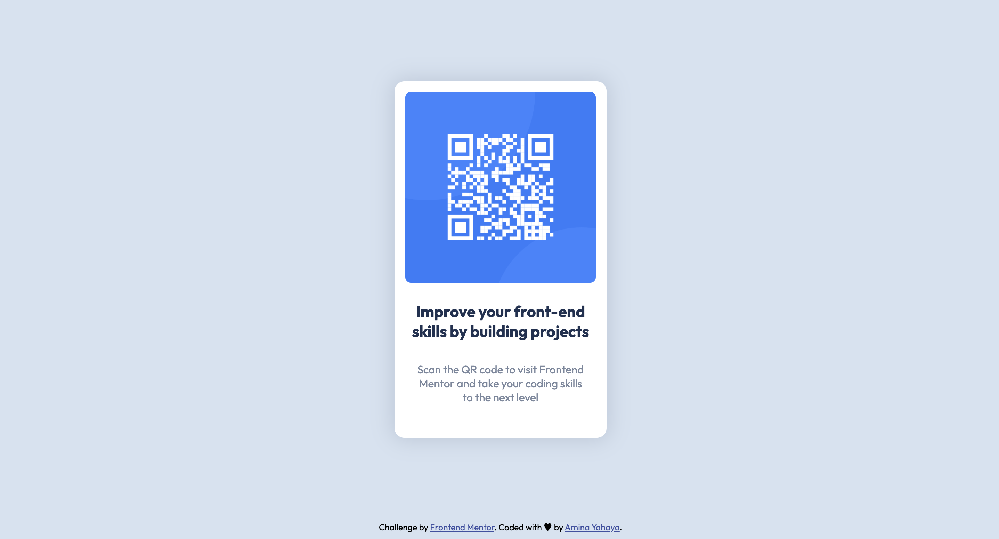

# Frontend Mentor - QR code component solution

This is my solution to the [QR code component challenge on Frontend Mentor](https://www.frontendmentor.io/challenges/qr-code-component-iux_sIO_H). Frontend Mentor challenges help you improve your coding skills by building realistic projects.

### Screenshot



### Links

- Solution URL: [View solution on Frontend Mentor](https://www.frontendmentor.io/solutions/minimalist-css-card-with-flexbox-fm8WmY3TOT
)
- Live Site URL: [live site](https://amis-qrcode-desgin.netlify.app/)

## My process

### Built with

- Semantic HTML5 markup
- CSS custom properties
- Flexbox

### What I learned

1. while trying to add the image, at first i wanted to put it in a div & give the div a certain size(width & height) , so that the image will be contained within it using a max-width of 100%, but i realized that method would just be some extra lines of codes. I could just change the display of the image to block(so it now behaves like a div), there was no need to crop it with a fixed height else it wouldn't look good in terms of aspect ratio. as shown in the code below the image size was computed based on the padding i assigned to the card!

2. I applied accessibility one function for screen readers.

See Favourite code snippets below:

```html
<h1 class="visually-hidden"></h1>
```

```css
.card {
  box-shadow: 0 0 30px 4px #7b879d48;
  padding: 0.85rem;
}
.card-img {
  display: block;
  width: 100%;
}
```

### Continued development

**NEXT ACTION**: Create more resposive designs & Mobile-first workflow.

## Author

- Frontend Mentor - [@Amiyahayadev](https://www.frontendmentor.io/profile/Amiyahayadev)
- LinkedIn - [Amina Yahaya](https://www.linkedin.com/mwlite/in/yaminajrfrontend020297)
